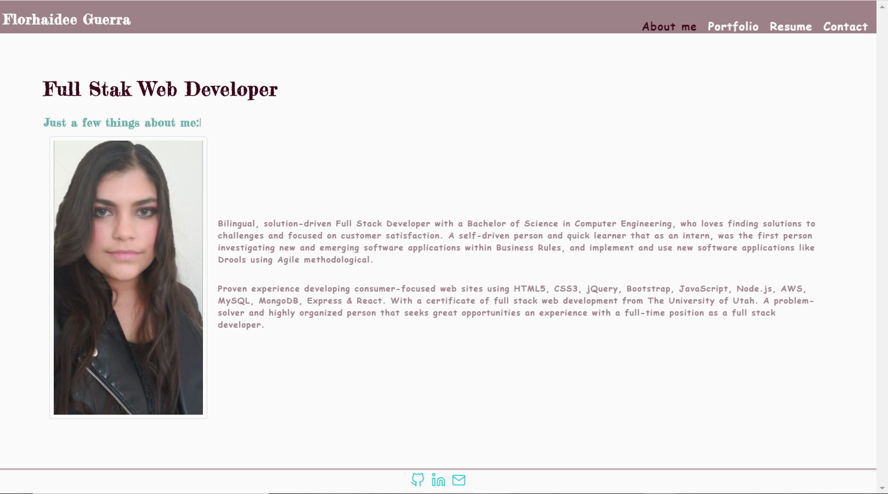
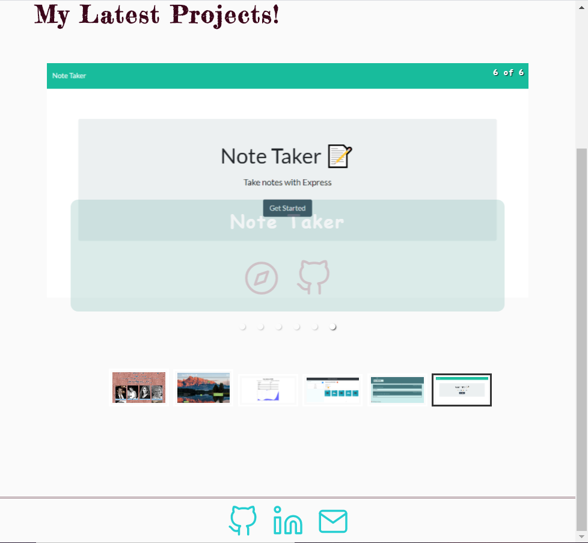
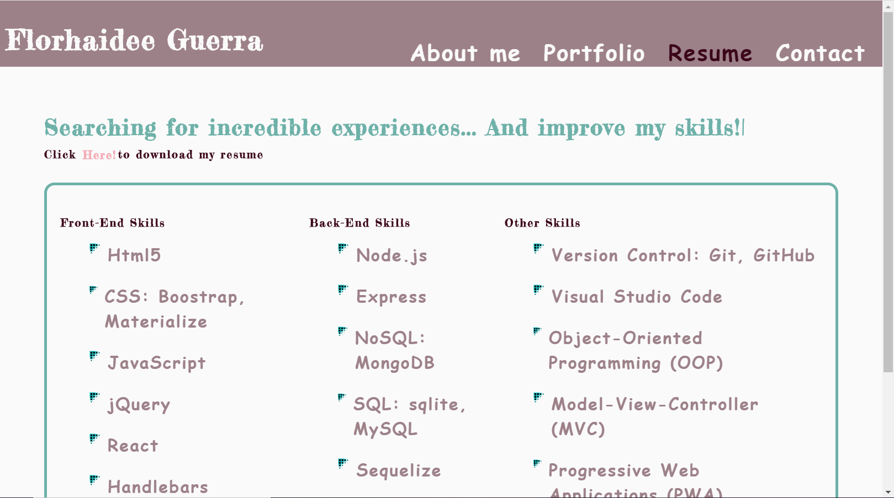

# React Portfolio  

This project was bootstrapped with [Create React App](https://github.com/facebook/create-react-app).
 

  ## Description 

  A Single-Page Application build it with React. In there you can see my more recent projects and download my resume!
  
  

  ## Table of Contents 
  * [Libraries](#Libraries)
  * [Usage](#usage)
  * [Features](#Features)
  * [License](#license)
  * [Contributing](#contributing)
  * [Questions](#questions)
  
  ## Libraries
   The libraries used on this app were:

    * "react": "^16.13.1",
    * "react-border-wrapper": "^1.0.3",
    * "react-dom": "^16.13.1",
    * "react-responsive-carousel": "^3.2.9",
    * "react-scripts": "3.4.3",
    * "react-typical": "^0.1.3",
    * "react-useanimations": "^2.0.5"

  ## Usage

  To go to the deployed application go to:
https://florhaidee.github.io/florhaidee-guerra/

  ## Features

  * When users open the application the main page display the About me Section, 

* There other three sections: Portfolio, Resume and Contact, here the screenshots:

   **Contact Form, still in development!

  ## License

    Copyright © 2020 florhaidee. 
    Licensed under the MIT to see more about this license you can find it on the file 'license.txt' go to [MIT-license](LICENSE) 

  ## Contributing 

    Please note that this project is released with a Contributor Code of Conduct. By participating in this project you agree to abide by its terms.
    Visit:
https://www.contributor-covenant.org/version/2/0/code_of_conduct/ to have more information.

    To contribute 
     * Add an issue
     * Create a new branch with format-name: 
        - (feature/name/your-name) or (bug/name/your-name) 
     * Make a pull request.

  ## Questions

    If you have more questions about this application, you can contact me by:
      email: florhaideeg@gmail.com
      GitHub username: florhaidee

  ## ©️2020  Made with ❤️ by florhaidee
